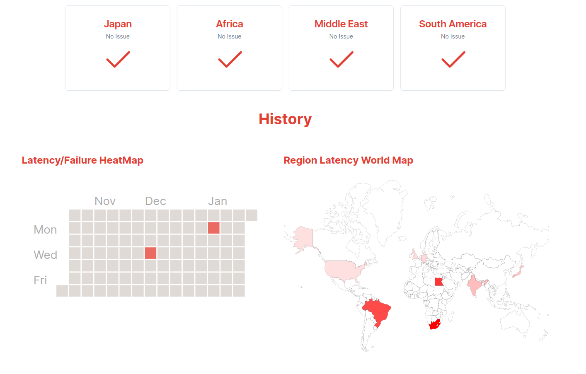

# HeartBeat

A simple status page for your services.

- [Live Preview](heartbeat-vert.vercel.app)

## Features

- One click deployment for your status page
- Easy to use
- Check latency of your services from across the globe
- Manage team members
- Add multiple services

## Preview



## Getting Started

Follow the instructions based on the package manager you use (npm/pnpm)

### Install dependencies

```bash
npm install
```

```bash
pnpm install
```

### Run the newly created app

```bash
npm run dev
```

```bash
pnpm run dev
```

## License

This project is licensed under the [MIT License](https://opensource.org/licenses/MIT) - see the [LICENSE](LICENSE) file for details.
